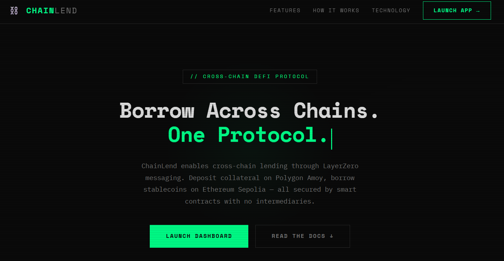
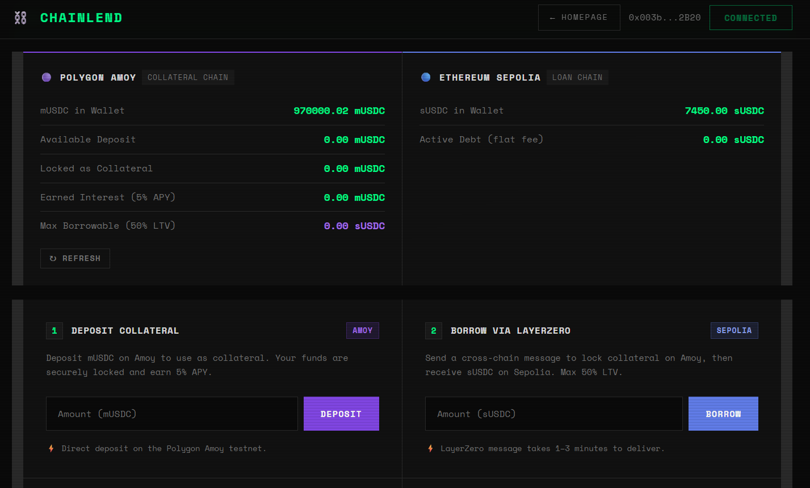

<p align="center">
  <h1 align="center">⛓️ ChainLend</h1>
  <p align="center">
    <strong>Cross-Chain DeFi Lending Protocol — Powered by LayerZero V2</strong>
  </p>
  <p align="center">
    Deposit collateral on Polygon Amoy · Borrow on Ethereum Sepolia · All via cross-chain messages
  </p>
  <p align="center">
    <a href="https://testnet.layerzeroscan.com">LayerZero Scan</a> ·
    <a href="https://amoy.polygonscan.com">Amoy Explorer</a> ·
    <a href="https://sepolia.etherscan.io">Sepolia Explorer</a>
  </p>
</p>

---

## 📖 Overview

**ChainLend** is a cross-chain decentralized lending protocol that lets users deposit tokens as collateral on one blockchain and borrow tokens on another — without bridging or selling their assets.

The core idea:

> _"I have tokens on Polygon Amoy. I want to borrow tokens on Ethereum Sepolia. Without selling or bridging my original tokens."_

Cross-chain coordination is handled by **LayerZero V2 OApp** messages. Tokens never leave their native chain — **only messages cross chains**.

---

## Prototype Screenshots

<table>
  <tr>
    <td align="center">
      
      <br/>
      <b>Homepage View</b>
    </td>
    <td align="center">
      
      <br/>
      <b>Dashboard View</b>
    </td>
  </tr>
</table>

---

## ✨ Key Features

- 🔗 **Real Cross-Chain Lending** — Deposit collateral on Polygon Amoy, borrow on Ethereum Sepolia
- ⚡ **LayerZero V2 Integration** — Genuine OApp messages for cross-chain state synchronization
- 🔒 **50% LTV Ratio** — Deposit 1,000 mUSDC to borrow up to 500 sUSDC
- 📈 **5% Deposit APY** — Earn interest on deposited collateral
- 💰 **Flat Fee Model** — Simple 10 sUSDC flat repayment fee per loan
- 🖥️ **Fully Functional dApp** — Vercel-ready frontend with MetaMask integration
- 📡 **On-Chain Polling** — Frontend polls Amoy state to detect LayerZero delivery in real-time

---

## 🏗️ Architecture

ChainLend uses a **one-way LayerZero messaging pattern** (Sepolia → Amoy). The frontend acts as the coordinator between both chains.

```
┌─────────────────────────────────────────────────┐
│                  USER LAYER                      │
│           MetaMask Wallet (same address)         │
│      Same wallet address on Amoy AND Sepolia     │
└─────────────────────┬───────────────────────────┘
                      │
                      ▼
┌─────────────────────────────────────────────────┐
│               FRONTEND LAYER                     │
│            Vercel Hosted Web App                 │
│  ethers.js v6 · Polls Amoy every 10s            │
│  Calls adminReleaseLoan after LZ confirmation   │
└──────────────┬──────────────────────┬────────────┘
               │                      │
               ▼                      ▼
┌──────────────────────┐  ┌──────────────────────────┐
│   POLYGON AMOY       │  │   ETHEREUM SEPOLIA        │
│  (Collateral Chain)  │  │   (Loan Chain)            │
│                      │  │                           │
│  MockUSDC (mUSDC)    │  │  MockUSDC (sUSDC)         │
│  AmoyLendingPool     │  │  SepoliaLendingPool       │
│  AmoyBridge          │  │  SepoliaBridge            │
│                      │  │                           │
│  EID: 40267          │  │  EID: 40161               │
└──────────────────────┘  └──────────────────────────┘
          ▲                            │
          │      LayerZero V2          │
          └────── REAL MESSAGES ───────┘
                  (one-way only)
                  Sepolia → Amoy
```

### Message Types

Only **two message types** travel over LayerZero, both in one direction (Sepolia → Amoy):

| Type | Code | Direction | Purpose |
|------|------|-----------|---------|
| `MSG_BORROW_REQUEST` | `1` | Sepolia → Amoy | Lock user's collateral (2× borrow amount) |
| `MSG_REPAY_UNLOCK` | `3` | Sepolia → Amoy | Unlock user's collateral after repayment |

---

## 📁 Project Structure

```
ChainLend/
├── Contracts/
│   ├── MockUSDC.sol              # ERC-20 mock stablecoin (6 decimals)
│   ├── AmoyLendingPool.sol       # Collateral pool on Polygon Amoy
│   ├── AmoyBridge.sol            # LayerZero receiver on Amoy
│   ├── SepoliaLendingPool.sol    # Loan pool on Ethereum Sepolia
│   └── SepoliaBridge.sol         # LayerZero sender on Sepolia
├── Frontend/
│   ├── index.html                # Homepage / landing page
│   ├── dashboard.html            # Main dApp interface
│   ├── style.css                 # Homepage styling
│   ├── dashboard_style.css       # Dashboard dark-theme styling
│   ├── app.js                    # Homepage script
│   ├── dashboard_app.js          # Dashboard application logic & polling
│   ├── constants.js              # Addresses, ABIs, protocol params
│   └── web3.js                   # Wallet & contract layer (ethers v6)
├── architecture.md               # Detailed architecture documentation
├── deploy_guide.md               # Step-by-step deployment guide
└── README.md
```

---

## 📜 Smart Contracts

### MockUSDC (`MockUSDC.sol`)
A simple ERC-20 token with 6 decimals (mirroring real USDC). Deployed on **both chains** — as `mUSDC` on Amoy and `sUSDC` on Sepolia. Features owner-controlled minting with the ability to permanently disable minting via `disableMinting()`.

### AmoyLendingPool (`AmoyLendingPool.sol`)
Manages collateral deposits on Polygon Amoy. Key responsibilities:
- **Deposit/Withdraw** — Users deposit and withdraw mUSDC
- **Lock/Unlock** — Only callable by the bridge contract; moves user funds between `available` and `locked` states
- **Interest accrual** — 5% APY computed via time-weighted snapshots
- **Security** — Uses `onlyBridge` modifier, `ReentrancyGuard`, and `SafeERC20`

### AmoyBridge (`AmoyBridge.sol`)
LayerZero OApp that **receives** cross-chain messages from Sepolia. Decodes the message type and calls `lock()` or `unlock()` on the AmoyLendingPool. Uses `try/catch` to ensure `_lzReceive` never reverts (which would permanently block the LayerZero channel).

### SepoliaLendingPool (`SepoliaLendingPool.sol`)
Manages loan issuance on Ethereum Sepolia. Key responsibilities:
- **`adminReleaseLoan()`** — Owner-only function to release sUSDC to borrower after collateral lock is confirmed
- **`repay()`** — Called by the bridge; collects principal + 10 sUSDC flat fee from user
- **One-loan-per-user** — Prevents overlapping cross-chain state

### SepoliaBridge (`SepoliaBridge.sol`)
LayerZero OApp that **sends** cross-chain messages to Amoy. Provides:
- **`requestBorrow(amount)`** — Sends `MSG_BORROW_REQUEST` with LZ fee in `msg.value`
- **`repayAndUnlock()`** — Calls `repay()` on the pool, then sends `MSG_REPAY_UNLOCK`
- **`quote()`** — Fee estimation for the frontend (always add 20% buffer)

---

## 🔄 User Flow

### Borrow Flow

```
1. DEPOSIT (Amoy)          User deposits mUSDC into AmoyLendingPool
                                    │
2. BORROW (Sepolia)        User calls SepoliaBridge.requestBorrow()
                                    │
3. CROSS-CHAIN             LayerZero delivers MSG_BORROW_REQUEST to Amoy
                                    │
4. LOCK (Amoy)             AmoyBridge calls LendingPool.lock(user, amount × 2)
                                    │
5. POLL                    Frontend polls Amoy locked[user] every 10 seconds
                                    │
6. RELEASE (Sepolia)       Owner calls adminReleaseLoan() → sUSDC sent to user
```

### Repay Flow

```
1. APPROVE (Sepolia)       User approves sUSDC (principal + 10 fee) to SepoliaPool
                                    │
2. REPAY (Sepolia)         User calls SepoliaBridge.repayAndUnlock()
                                    │
3. CROSS-CHAIN             LayerZero delivers MSG_REPAY_UNLOCK to Amoy
                                    │
4. UNLOCK (Amoy)           AmoyBridge calls LendingPool.unlock(user, amount × 2)
                                    │
5. WITHDRAW (Amoy)         User withdraws mUSDC + earned interest from pool
```

---

## ⚙️ Protocol Parameters

| Parameter | Value | Description |
|-----------|-------|-------------|
| **LTV** | 50% | Deposit 1,000 mUSDC → Borrow max 500 sUSDC |
| **Deposit APY** | 5% per year | Time-weighted interest on Amoy deposits |
| **Borrow Fee** | Flat 10 sUSDC | Fixed per-loan fee (no time-based interest) |
| **LayerZero Gas** | 300,000 units | Executor gas limit for `_lzReceive` on Amoy |
| **Poll Interval** | 10 seconds | Avoids RPC 429 rate limits on free tiers |
| **Poll Timeout** | 5 minutes | Max wait before showing timeout error |

---

## 🛡️ Security Design

- **`onlyBridge` modifier** — Only the bridge contract can call `lock()` and `unlock()`
- **`try/catch` in `_lzReceive`** — Failures emit events instead of reverting to keep the LZ channel open
- **`adminReleaseLoan` is `onlyOwner`** — Prevents unauthorized loan releases
- **One loan per user** — `require(!loans[user].active)` prevents overlapping cross-chain state
- **`msg.value` forwarding** — ETH is explicitly forwarded to `_lzSend` to avoid `NotEnoughNative` errors
- **ReentrancyGuard** — Both lending pools are protected against reentrancy attacks
- **SafeERC20** — All token transfers use OpenZeppelin's `SafeERC20`

---

## 🛠️ Tech Stack

| Layer | Technology |
|-------|------------|
| **Smart Contracts** | Solidity 0.8.19 |
| **Cross-Chain Messaging** | LayerZero V2 OApp |
| **Token Standard** | OpenZeppelin ERC-20, Ownable, ReentrancyGuard |
| **Frontend Library** | ethers.js v6 (CDN) |
| **Frontend** | Vanilla HTML/CSS/JS |
| **Wallet** | MetaMask |
| **Deployment Tool** | Remix IDE |
| **Hosting** | Vercel |
| **Collateral Chain** | Polygon Amoy Testnet (Chain ID: 80002) |
| **Loan Chain** | Ethereum Sepolia Testnet (Chain ID: 11155111) |

---

## 🚀 Getting Started

### Prerequisites

- [MetaMask](https://metamask.io/) browser extension
- Amoy testnet MATIC — [Polygon Faucet](https://faucet.polygon.technology)
- Sepolia testnet ETH — [Sepolia Faucet](https://sepoliafaucet.com)
- [Remix IDE](https://remix.ethereum.org) for contract deployment

### Network Configuration

#### Polygon Amoy

| Field | Value |
|-------|-------|
| Network Name | Polygon Amoy Testnet |
| RPC URL | `https://rpc-amoy.polygon.technology` |
| Chain ID | `80002` |
| Symbol | `MATIC` |
| Explorer | `https://amoy.polygonscan.com` |

#### Ethereum Sepolia

| Field | Value |
|-------|-------|
| Network Name | Ethereum Sepolia |
| RPC URL | `https://ethereum-sepolia-rpc.publicnode.com` |
| Chain ID | `11155111` |
| Symbol | `ETH` |
| Explorer | `https://sepolia.etherscan.io` |

### Deployment

ChainLend is deployed entirely through **Remix IDE**. The full step-by-step process is documented in [`deploy_guide.md`](./deploy_guide.md), covering:

1. Compile all 5 contracts with Solidity 0.8.19 (EVM: Paris, optimization: 200 runs)
2. Deploy MockUSDC, LendingPool, and Bridge on **both chains**
3. Wire contracts (set peers, bridges, and lending pool references)
4. Fund the Sepolia pool with 500,000 sUSDC loan liquidity
5. Set enforced options for LayerZero executor gas
6. Update `Frontend/constants.js` with deployed addresses

### Running the Frontend

The frontend is a static site — serve it with any HTTP server:

```bash
# Using Python
cd Frontend
python -m http.server 8080

# Or using Node
npx serve Frontend

# Or deploy directly to Vercel
```

Open `http://localhost:8080` and connect MetaMask to start using ChainLend.

---

## 🔗 Deployed Addresses

> Addresses below are from the latest deployment. Source of truth: [`Frontend/constants.js`](./Frontend/constants.js)

### Polygon Amoy (Chain ID: 80002 | EID: 40267)

| Contract | Address |
|----------|---------|
| MockUSDC (mUSDC) | `0x6Adb01c8d0784C1889861256418C51073EB141E3` |
| AmoyLendingPool | `0x08089E241B115eaBBcab80D74C02019B7C4133A9` |
| AmoyBridge | `0xD8355888Ccec8204285349ffA7c968C43eDBA84e` |

### Ethereum Sepolia (Chain ID: 11155111 | EID: 40161)

| Contract | Address |
|----------|---------|
| MockUSDC (sUSDC) | `0x990Dc238F484F1dbEDbC1909a0Bb484C4B704aDB` |
| SepoliaLendingPool | `0x2130b4403A398C612CBfDb266cbe9634E9949e0f` |
| SepoliaBridge | `0xA203f5c85767A14E22722c7e419f54227328C116` |

### Shared

| Config | Value |
|--------|-------|
| LayerZero Endpoint | `0x6EDCE65403992e310A62460808c4b910D972f10f` |
| Deployer/Owner | `0x003b739410f14b248A2A24cd4FC4021F40Fc2B20` |

---

## 🧪 Testing the Full Flow

After deployment, run the complete end-to-end test:

1. **Deposit** — Switch to Amoy → Approve & deposit mUSDC
2. **Borrow** — Switch to Sepolia → Click Borrow → Pay LZ fee in ETH
3. **Wait** — Frontend polls Amoy for ~1-3 minutes until collateral locks
4. **Receive** — sUSDC automatically released to your wallet on Sepolia
5. **Repay** — Approve sUSDC (principal + 10 fee) → Click Repay
6. **Unlock** — LayerZero delivers unlock message → Collateral freed on Amoy
7. **Withdraw** — Switch to Amoy → Withdraw mUSDC + earned interest

Track all LayerZero messages at [testnet.layerzeroscan.com](https://testnet.layerzeroscan.com).

---

## ⚠️ What Is Real vs Simplified

### ✅ Real (Genuine Cross-Chain)
- LayerZero V2 OApp messages sent Sepolia → Amoy
- Real message hashes visible on LayerZero Scan
- Real `_lzReceive` execution on Amoy by LZ executor
- Real collateral locking/unlocking on-chain
- Real token movements & MetaMask transactions on both chains
- Real LZ fees paid in ETH

### 🔧 Simplified (For Demo Clarity)
- **No ABA return message** — Frontend polling + `adminReleaseLoan` replaces auto-release
- **Flat fee** instead of time-based APR — 10 sUSDC per loan vs variable-rate interest
- These simplifications demonstrate the same architectural patterns used in production (e.g., off-chain coordination via Chainlink Automation or Gelato)

---

## 📚 Documentation

| Document | Description |
|----------|-------------|
| [`architecture.md`](./architecture.md) | Deep-dive into the system architecture, message flow, and design decisions |
| [`deploy_guide.md`](./deploy_guide.md) | Complete step-by-step deployment guide with troubleshooting |

---

## 📄 License

This project is licensed under the MIT License — see the [LICENSE](./LICENSE) file for details.

---

<p align="center">
  <strong>ChainLend</strong> — Cross-Chain DeFi Lending using LayerZero V2 OApp<br/>
  Polygon Amoy (Collateral) ↔ Ethereum Sepolia (Loans)
</p>
